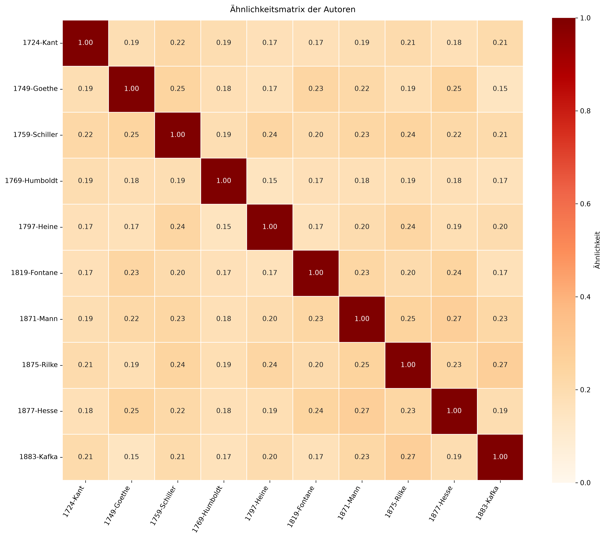
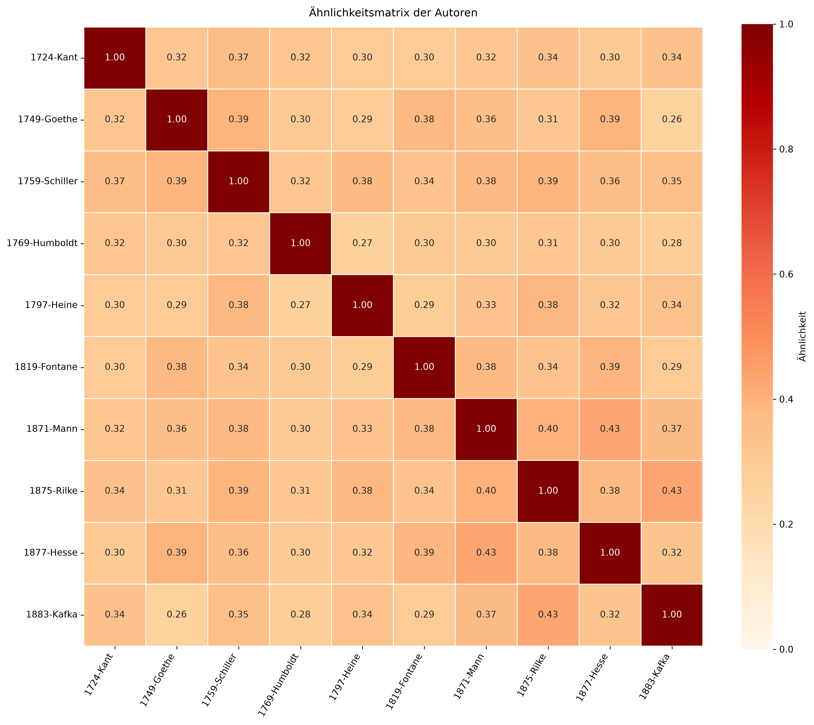
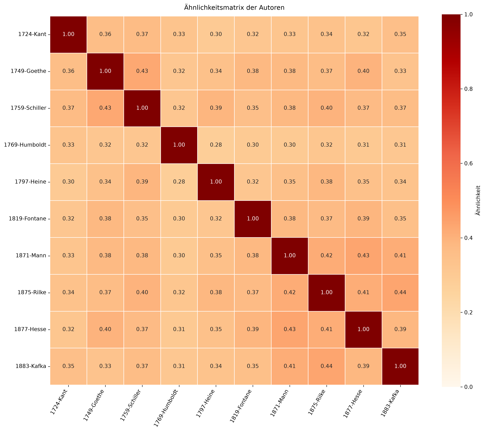

# Diskussion und Vergleich der Ähnlichkeitswerte

## Jaccard

*Berechnung*:  
Angabe der Ähnlichkeit als Verhältnis der Schnittmenge gemeinsamer Terme an der Vereinigungsmenge aller Terme beider Autoren (auch: Intersection over Union).

## Dice

*Berechnung*:  
Die Schnittmenge wird durch das arithmetische Mittel (Summe der Termmengen geteilt durch die Anzahl an Termmengen) für die beiden Termmengen geteilt.

*Verwendung*:  
Bei unterschiedlich großen Termmengen werden die gemeinsamen Terme in Vergleich zu Jaccard stärker gewichtet. Relevant, wenn das Auffinden von Gemeinsamkeiten wichtig ist.

## Otsuka-Ochiai

*Berechnung*:  
Ähnlich wie Dice, nur dass die Schnittmenge durch das [geometrische Mittel](https://www.datacamp.com/de/tutorial/geometric-mean) für beide Termmengen geteilt wird (n-te Wurzel aus dem Produkt der n Termmengen).

*Verwendung*:  
Das geometrische Mittel ist noch weniger empfindlich ggü. Extremwerten oder Ausreißern, wenn ein Korpus deutlich mehr Terme als der andere. Der Einfluss von Extremwerten im Vergleich zum arithmetischen Mittel wird somit minimiert, die zentrale Tendenz genauer abgebildet.

## Diskussion

### Termanzahl der einzelnen Autoren

33489 Fontane  
42536 Goethe  
13122 Heine  
31967 Hesse  
23472 Humboldt  
9550 Kafka  
15518 Kant  
24803 Mann  
13797 Rilke  
18467 Schiller  

### Auffällige Autoren bei Jaccard:
- "Kennst Du Schiller, kennst Du alle":
    - Schiller, Kant und Humboldt haben jeweils recht geringe Schwankungen in den Ähnlichkeitswerten zu anderen Autoren. 
        - Bes. Humboldt hat durchgehend sehr geringe Ähnlichkeitswerte, während Schiller von den drei Autoren mit allen anderen Autoren die höheren Ähnlichkeiten aufweist.
- Im Gegensatz dazu fällt Kafka auf, der besonders mit einem Autor - Rilke - eine hohe Ähnlichkeit aufweist.
- Differenz von min zu max 
    - bei Schiller: 0.06
    - bei Kafka: 0.12

### Vergleich Dice und Jaccard
- Dice-Werte liegen prinzipiell höher als Jaccard-Werte.
    - Siehe Berechnungsmethoden: Dice halbiert den Teiler (bzw. verdoppelt den Zähler) -> Quotient wächst
    - Dice verwendet im Teiler die Summe der Terme in beiden Korpora, nicht die Vereinigungsmenge 
        - -> je stärker der Unterschied zwischen zwei Korpora, desto mehr nähert sich die Anzahl der Vereinigungsmenge der Summe beider Mengen an 
        - -> Dice-Wert daher näher zu Jaccard-Wert bei Korpora mit geringer Schnittmenge/geringerer Ähnlichkeit
        - -> anders ausgedrückt: je ähnlicher zwei Korpora, desto größer der Unterschied zw. Dice- und Jaccard-Wert
        - Bsp. Kafka: 
            - Kafka zu Goethe:
                - Jaccard: 0,15, Dice, 0,26, diff: 0,11
            - Kafka zu Rilke:
                - Jaccard: 0,27, Dice: 0,43, diff: 0,16
        - -> **Dice: Betonung von Gemeinsamkeiten**
- Differenz von min und max 
    - bei Schiller: 0,07
    - bei Kafka: 0,17
    - Differenz bei Kafka gewachsen -> Durch Betonen von Gemeinsamkeiten **fallen die ähnlichen** Korpora bei Autoren mit stärker variierenden Ähnlichkeiten **stärker auf**

## Vergleich Otsuka-Ochiai und Dice:
- Allgemein scheinen sich die Werte zwischen Otsuka-Ochiai und Dice nicht sehr zu unterscheiden, bis auf wenige Ausnahmen
- Differenzen von min und max
    - bei Schiller: 0,11
    - bei Kafka: 0,13
- die gewachsene Differenz bei Schiller geht auf den gewachsenen Ähnlichkeitswert zu Goethe zurück der von 0,39 (Dice) auf 0,43 gewachsen ist (während bei den anderen Autoren sich die Otsuka-Ochiai-Ähnlichkeitswerte von den Dice-Werten kaum unterscheiden).
    - Anzahl Terme bei Schiller: 18.467
    - Anzahl Terme bei Goethe: 42.536
    - Anzahl Terme bei Fontane: 33.489
    - -> hier zeigt sich der ausgleichende Effekt bei unterschiedlich großen Korpora: die Ähnlichkeit zwischen Goethe und Schiller wird nun stärker betont, während die Ähnlichkeit zw. Schiller und Fontane - obwohl auch hier ein deutlicher Unterschied in den Termanzahl vorliegt - in etwa gleich blieb.
- bei Kafka ist ein umgekehrter Effekt zu sehen: die Ähnlichkeit zum ähnlichsten Autor (Rilke) ist etwa gleich geblieben (-0,01), während die Werte zu anderen Autoren gewachsen sind, bes. zu Goethe (+0,07)
    - Auch dies ist wohl darauf zurückzuführen, dass Kafkas Korpus mit nur 9.550 Termen der kleinste Korpus in der Sammlung ist, und somit der ausgleichende Effekt von Otsuka-Ochiai bei den Ähnlichkeiten zu Kafka sich am häufigsten auswirkt.

## Weitere Fragen
- Wie kann die Häufigkeit der Terme berücksichtigt werden? Zwei Korpora, bei denen ein Term ähnlich häufig vorkommt sollten ähnlicher sein, als zwei Korpora, bei denen die Häufigkeit eines Terms sich stark unterscheidet.
- Aussagekraft der Ähnlichkeit, da keine Semantik abgebildet wird? 
